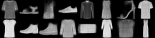

# CPSC 502 Research Project
**Authors:** Manveet Mandal (student) and Usman Alim (supervisor)
\
\
This repo is for my CPSC 502 project.

Currently there is a basic variational autoencoder (VAE) implemented. It is trained on the [fashion-mnist](<https://github.com/zalandoresearch/fashion-mnist>) dataset.

## Installation
The project is implemented in Pytorch using various libraries such as Numpy etc.
\
The evironment for the project is managed through the [environment.yml](<environment.yml>) file.
\
Run: conda env create -f environment.yml 
\
This will create the conda environment to run.
\
Execution code is in main.py. Running it will ask for dimension for hidden layer (encoder) and latent space dimension, then it will train. The run can be visualized through tensorboard. 
\
To use tensorboard: tensorboard --logdir=runs
\
In tensorboard you can visualize the gradient and losses. You can also visualize the reconstructed images from input and randomly sampled images from the latent space as well.

## Visualization
**Here are 16 samples from the latent space**
\

